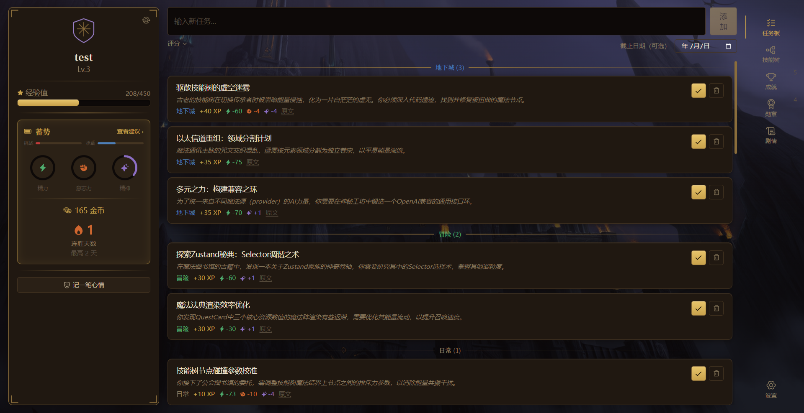

# 游纪 · MyGame

> 把日常事务变成一场角色扮演冒险。

游纪是一款桌面自我管理应用。你是一名「骑士」，日常的待办事项都是「任务」——完成任务能获得成长，解锁新内容，看着自己的角色一点点变强。它不是冷冰冰的任务清单，而是一个会给你反馈、会讲故事的小世界。

本地运行，离线可用，你的数据只留在自己的电脑上。

## 截图




## 这是什么样的体验

- **完成任务，看角色成长**：每完成一件事，角色都会获得实实在在的反馈——经验、金币、状态变化，一目了然
- **专属的技能树**：随着你完成不同类型的任务，技能树会点亮、升级，AI 还会不时为你的角色占卜出全新的专属技能
- **会生成内容的世界**：成就徽章、技能图标、背景画面，都是 AI 根据你的角色实时生成的，每个人的世界都长得不一样
- **懂你的状态**：应用会感知你最近的节奏，是冲刺、是鏖战、还是该歇一歇，并给出相应的建议
- **越用越懂你**：AI 会持续了解你的习惯和偏好，任务预估和建议也会越来越贴合实际
- **剧情日志**：一段时间后，AI 会把你的进展写成一段故事，回顾起来更有意思
- **随时可见**：除了主界面，还有常驻小窗、悬浮任务面板、全局热键快速记录，桌面上随手就能用
- **多种世界观任选**：从武侠、仙侠、玄幻到写实、末日、科幻，挑一个你喜欢的画风
- **多家 AI 服务可选**：支持接入多家主流 AI 服务商，随心配置

## 下载与使用

从 [Releases](https://github.com/Rekk0/MyGame/releases) 下载最新版本：

- **便携版（portable）**：免安装，下载 `.exe` 双击即可运行
- **安装版（setup）**：常规 Windows 安装包

请自行在右下角设置中配置AI服务；
通用API key需要文生文模型；
背景图生成需要文生图模型；

## 开发者信息

<details>
<summary>面向想要自行构建或参与开发的人</summary>

### 技术栈

| 层 | 选型 |
|----|------|
| 桌面 | Electron 31（多窗口） |
| UI | React 18 + TypeScript 5.5 |
| 构建 | electron-vite + Vite 5 |
| 样式 | Tailwind CSS 4 + Framer Motion |
| 状态 | Zustand 5 |
| 数据库 | better-sqlite3 + Drizzle ORM |
| 可视化 | D3.js（技能树） |
| AI | Anthropic SDK + OpenAI 兼容客户端 |

### 架构

- **主进程**（`electron/`）：窗口生命周期、IPC、SQLite/Drizzle、全部 AI 调用、
  全局快捷键、托盘、通知。不含 React。
- **渲染进程**（`src/`）：跨多个窗口共享组件与 store 的 React UI。
- **Preload**（`electron/preload/`）：暴露给渲染进程的 IPC 桥。

```
renderer (React) → preload IPC → 主进程 IPC handler → Drizzle → SQLite
                 ← Zustand store ← IPC 返回 ←──────────────────┘
```

数据、AI、勋章等按 domain 拆分：IPC handler、Zustand store、DB repository、React 组件
各自一个目录一类职责。所有 AI 生成内容缓存进 SQLite，保证离线可用。

### 开发命令

需要 Node.js 与 npm。

```bash
npm install          # 安装依赖（postinstall 会重建原生 better-sqlite3）
npm run dev          # 启动应用（HMR）
npm run build        # 类型检查 + 构建
npm run build:win    # 构建并打包 Windows 安装包（另有 :mac / :linux）
npm run typecheck    # tsc --noEmit
npm run lint         # eslint --fix
npm run format       # prettier --write
npm run test         # vitest
```

数据库文件位于用户数据目录（`%APPDATA%/my-game/my-game.db`），迁移在启动时自动执行。

### 目录结构

```
electron/
  main.ts              # 入口 / 启动序列
  windows/             # 每个窗口一个文件（main/hud/questHud/quickInput/achievement/companion）
  ipc/                 # IPC handler，按 domain 一个文件
  services/
    ai/                # AI 客户端、缓存、各场景 prompt
    db/                # schema、migrations、各表 repository
    resources/         # 资源结算与本地校准
    dda/               # 状态判定
    skill/             # 技能生成、图标生成、经验授予
    profile/           # 用户画像构建
    companion/         # AI 桌面伴侣（开发中，默认关闭）
  preload/
src/
  *.tsx / *.html       # 各窗口入口
  components/          # 按功能拆分：CharacterCard/QuestBoard/SkillTree/MedalGallery/
                       #   Achievement/Journal/QuickInput/Companion/HUD/shared/shell
  stores/  hooks/  utils/  types/
```

</details>

## License

本项目采用 **[GNU AGPL v3.0（或更新版本）](./LICENSE)** 开源。

这是一个 OSI 认证的开源许可证：**允许**任何人自由使用、修改、分发，**包括商业用途**。
但作为 copyleft 强条款——任何人分发本项目的衍生版本、或将其作为网络服务（SaaS）
提供给他人使用时，**必须同样以 AGPL v3 开源其完整源码**。闭源套壳不被允许。

Copyright (c) 2026 Rekk0
